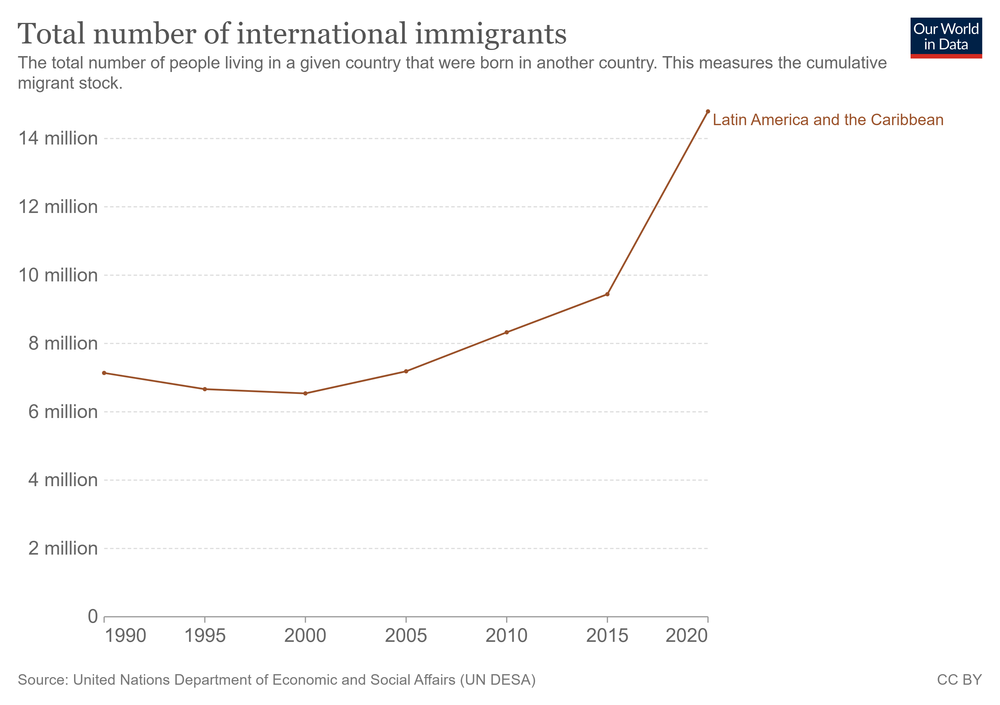

# Predicting Emigration from Latin America and the Caribbean due to Climate Change
## Project information
**Author**: Isabella Kroon, Computation and Design (Social Policy), Class of 2025, Duke Kunshan University

**Instructor**: Prof. Luyao Zhang, Duke Kunshan University

**Disclaimer**: Submitted to the Final Project for [STATS201 Introduction to Machine Learning for Social Science, 2022 Autumn Term (Seven Week - Second)](https://ms.pubpub.org/) instructed by Prof. Luyao Zhang at Duke Kunshan University.

**Acknowledgments**: My sincerest thanks to Professor Luyao Zhang for her teachings in Machine Learning for Social Science, to Yutong Sun for her valuable advise as peer reviewer, and to [Whimsical](https://whimsical.com), [Plotly](https://plotly.com/python/), and [Canva](https://www.canva.com/).

**Project Summary**: 
  - **Background & Motivation:** According to the World Bank, Latin America, Sub-Saharan Africa, and Southeast Asia will produce 143 million climate migrants by 2050 (Rigaud et al). However, climate change is currently not recognized as a reason to grant refugee status. It is important to understand the effects of climate change on migration to advocate for the millions of people who will be displaced in the coming years.
  - **Research Question:** How does change in yearly temperature (x) influence emigration from Latin America and the Caribbean (y)?
  - **Application Scenario (Data Source):** The data will be sourced from [OurWorldInData.org](https://ourworldindata.org/migration) to project emigration from Latin America and the Caribbean. 
  
The following figure helps us to better understand emigration in this area:
 
 
 
  This figure shows emigration from Latin America and the Caribbean, in millions of people, from 1990-2020. The figure shows that emigration from Latin America and the Caribbean has doubled since 1990 (Ortiz-Ospina et al).

  - **Methodology:** We will use an agent-based model from a study of migration in Thailand that incorporates the various factors that influence migration, such as population growth and economic instability, as well as demographic and land use data (Entwisle et al). Then we will subject this model to various long-term weather conditions and climate shocks, and model the subsequent changes in migration. By keeping all other factors constant, we can control for other influential variables and find the effect of climate change.
  
*Jargon: Agent-based models are simulations used to study interactions between people, places, things, and time. Agents are assigned specific qualities to interact with other agents in specific ways. ABMs are good for understanding complex relationships involving multiple influences. ABMs are best for cases when interrelatedness, reciprocity, and feedback loops are believed to exist (“Agent-Based Modeling | Columbia Public Health,” n.d.).*
 
  - **Results:** We expect our results to find a relationship between climate change and emigration. We expect this relationship to be positive, meaning we expect that climate change increases the rate of emigration from Latin American and Caribbean countries
  - **Intellectual Merits and Practical Impacts:** We identify three areas for contribution. First, Rigaud et al (2018) used machine learning to model climate migration. However, this study focused on Central America and used Mexico as a case study. We plan to focus on Latin America and the Caribbean in its entirety for a more comprehensive understanding of climate change. Second, Entwisle et al (2016) used the agent-based model that incorporated demographic and land use data. This study modeled climate migration in Thailand, so we will verify the model's efficacy by applying it to a new case study. Furthermore, we will apply new, relevant agents to Latin America's situation. Finally, Kaenzig et al (2014) discussed the current understanding of climate change in Latin America. The paper found that this area is "highly at risk yet very little studied." This finding further makes the case for our study to close gaps in existing knowledge.

## Table of Contents
- data
- code
- spotlight
- more about the author
- references

## Data
|Data Source:| [Our World In Data](https://ourworldindata.org/migration)|
|------|-----|
|Queried Data|[Link](data/Queried_Data/migration.csv)|
|Processed Data|[Link](data/Processed_Data/Processed_Data.csv)|

## Code
|Code|Link|
|---|---|
|Query Data| The data was queried through .csv file manipulation in Excel|
|Process Data|[Link](
- Analyze Data
- ...

## Spotlight

- Figures
- Slides
- Presentations
- Review articles
- Media appearance

## More about the Author

Isabella Kroon is a sophomore student at Duke Kunshan University, majoring in Computation and Design with a track in Social Policy and an Environmental Sustainability concentration. She is interested in how statistics and computation can be used to understand environmental issues and better inform environmental policy.

- Final reflections 

[how to apply a various machine learning methods to solve social science issues?]

### Literature

- Literature References in [Chicago Author-Date](https://www.chicagomanualofstyle.org/tools_citationguide/citation-guide-2.html) Style and [BibTex](https://scholar.google.com/) 

“Agent-Based Modeling | Columbia Public Health.” n.d. Www.publichealth.columbia.edu. Columbia University. [https://www.publichealth.columbia.edu/research/population-health-methods/agent-based-modeling](https://www.publichealth.columbia.edu/research/population-health-methods/agent-based-modeling).

Entwisle, Barbara, Nathalie E. Williams, Ashton M. Verdery, Ronald R. Rindfuss, Stephen J. Walsh, George P. Malanson, Peter J. Mucha, et al. 2016. “Climate Shocks and Migration: An Agent-Based Modeling Approach.” Population and Environment 38 (1): 47–71. [https://doi.org/10.1007/s11111-016-0254-y](https://doi.org/10.1007/s11111-016-0254-y).

Hsiang, Solomon M., and Adam H. Sobel. 2016. “Potentially Extreme Population Displacement and Concentration in the Tropics under Non-Extreme Warming.” Scientific Reports 6 (1): 25697. [https://doi.org/10.1038/srep25697](https://doi.org/10.1038/srep25697).

Kaenzig, Raoul, and Etienne Piguet. 2013. “Migration and Climate Change in Latin America and the Caribbean.” People on the Move in a Changing Climate 2 (August): 155–76. [https://doi.org/10.1007/978-94-007-6985-4_7](https://doi.org/10.1007/978-94-007-6985-4_7).

Ortiz-Ospina, Esteban, Max Roser, Hannah Ritchie, Fiona Spooner, and Marcel Gerber. 2022. “Migration.” Our World in Data, November. [https://ourworldindata.org/migration](https://ourworldindata.org/migration).

Rigaud, Kanta Kumari, Alex de Sherbinin, Bryan Jones, Jonas Bergmann, Viviane Clement, Kayly Ober, Jacob Schewe, et al. 2018. “Groundswell: Preparing for Internal Climate Migration.” WorldBank.org. Washington, DC: World Bank. [https://doi.org/http://hdl.handle.net/10986/29461](https://doi.org/http://hdl.handle.net/10986/29461).
